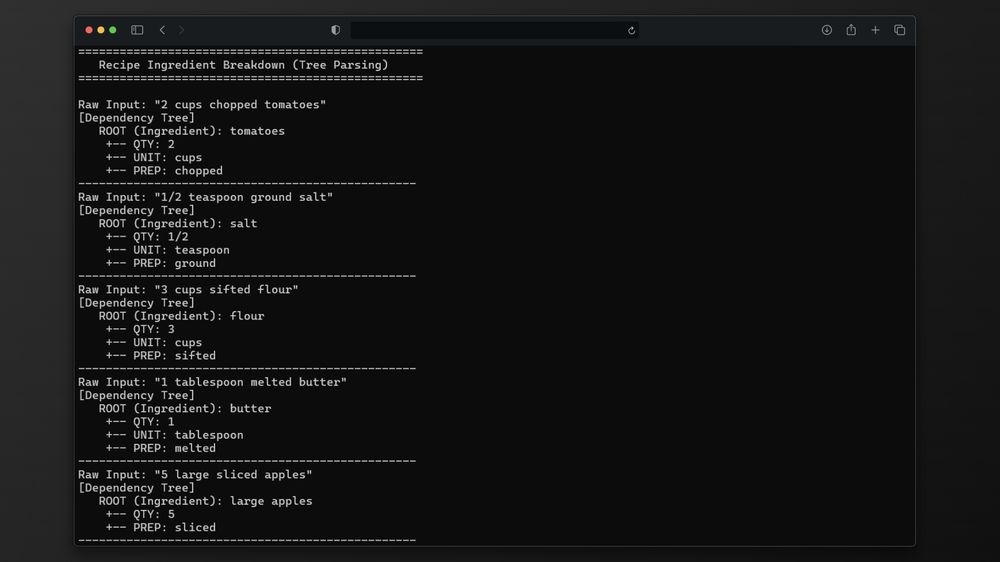

<div align="center">
  

  # 🥦 Recipe Ingredient Parser (C Implementation)
  
  **A Data Structures project implementing Tree Parsing to extract structured data from unstructured recipe text.**
  
  <!-- Badges -->
  <p>
    
    
    
  </p>
</div>

## 📖 Overview
Based on the concept of **"Recipe Ingredient Breakdown using Tree Parsing"**, this project demonstrates how to use **Data Structures (General Trees)** to model grammatical dependencies.

Instead of heavy NLP libraries (like Python's spaCy), this C implementation uses a **Rule-Based Parser** to identify quantities, units, and preparations, organizing them into a hierarchical tree structure.

---

## 🏗️ Data Structures Used

| Structure | Usage in Project |
| :--- | :--- |
| **N-ary Tree** | Represents the **Dependency Tree**. The `Ingredient` is the Root, and modifiers (`Qty`, `Unit`, `Prep`) are children. |
| **Linked List** | Used within the Tree node logic (`nextSibling`) to allow dynamic numbers of children (modifiers). |
| **Structs** | Used to define the parsed Nodes and their Types (Root, Quantity, Unit, etc.). |

---

## 🧩 Algorithm Logic
1.  **Input:** Raw string (e.g., `"2 cups chopped tomatoes"`).
2.  **Tokenization:** Splits string into words.
3.  **Classification:**
    *   Checks if word is a Number -> `QUANTITY`
    *   Checks against Dictionary -> `UNIT` or `PREPARATION`
    *   Otherwise -> `INGREDIENT` (Root)
4.  **Tree Construction:** Connects modifiers as children to the Root Ingredient.

---

## 💻 Output Screenshot

<div align="center">
  <!-- Replace with your actual screenshot -->
  <a href="assets/output.png" target="_blank">
    
  </a>
</div>

---

## 🛠️ How to Run

1.  **Compile:**
    ```bash
    gcc -Iinclude src/main.c src/tree.c src/parser.c -o recipe_parser
    ```

2.  **Run:**
    ```bash
    ./recipe_parser.exe
    ```

## 👨‍💻 Author
**Kavin.DR**  
*Department of Computer Science*<br>
***Kalaignarkarunanidhi Institute of Technology, Coimbatore***
